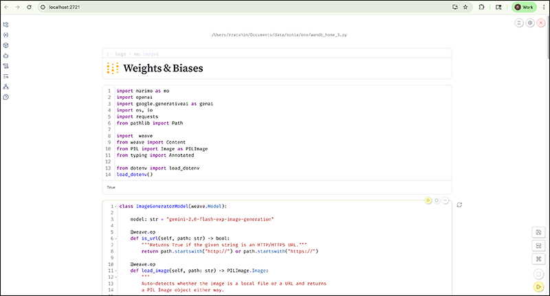
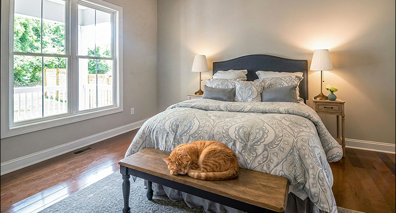

# AI Builders

## Project #1: 🏠 AI Interior Decorator (W&B Home)

 

This repository contains all the code, sample images, and supporting materials used in our first AI demo project.  
Our AI Interior Decorator lets you **visualize how new furniture would look in your own space, before you buy it**.

## ✨ Project Overview

Use this project to see how different lamps, sofas, and other pieces of furniture from store catalogs will appear in photos of your actual rooms. With the help of AI, you can easily try out new interior design ideas, experiment with styles, and make smarter home décor decisions, no heavy lifting required!

## 📦 What’s Included

- 📷 **Sample photos of real room interiors and lamp images from store catalogs**
- 📝 **Code and notebooks** for running the AI decorator demo
- 🗒️ **Instructions** to get set up and help you try it with your own room and furniture photos


<br><br>

## 🚀 Getting Started

Get your local environment ready in a few easy steps!

---

### 1. **Clone the GitHub Repository**

```bash
git clone https://github.com/rratshin-wandb/ai-builders.git
```

---

### 2. **Navigate to the Project Directory**

```bash
cd ai-builders/wandb_home
```

---

### 3. **Create a Virtual Environment**

```bash
python -m venv venv
```

---

### 4. **Activate the Virtual Environment**

```bash
source venv/bin/activate
```

---

### 5. **Install Python Libraries**

```bash
pip install -r requirements.txt
```

---

### 6. **Sign Up for a Free W&B Weave Account** 🌟

Monitor, evaluate, and iterate on your AI projects with [W&B Weave](https://wandb.me/tryweave)!  
If you don’t already have a free account, [sign up here](https://wandb.me/tryweave).

---

### 7. **Update Your Environment Variables**

Edit your `.env` file and fill in the required values:

```bash
vi .env
```
Or open it in your favorite text editor.

---

### 8. **Open the Marimo Notebook in Edit Mode**

```bash
marimo edit wandb_home.py
```

---

### 9. **Start Building!** 🚧

You’re all set—dive into the notebook and get to work!

---

**Need help?**  
Please [open an issue](https://github.com/rratshin-wandb/ai-builders/issues) or start a discussion if you get stuck.

---
